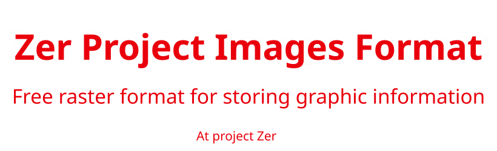

**English (translation)**

# ZPIF File Format Description  

ZPIF (Zer Project Image Format) is a free raster format for storing graphical information.  

## File Structure  

A ZPIF file consists of data blocks called **chunks**, each 6 bytes in size. Types of chunks:  

1. **Header Chunk** — Always at the beginning of the file, used for identification.  
2. **Parameter Chunks** — Define image properties (width, height, etc.).  
3. **Structuring Chunks** — Mark the beginning of pixel data and the end of the file.  
4. **Pixel Chunks** — Contain pixel color information.  

## Header Chunk  

The first chunk of the file always contains the signature `89 5A 50 49 46 0A` in hexadecimal (hex) format or `�ZPIF` in text representation. This signature allows programs to identify the file as a ZPIF format file.  

## Parameter Chunks (Image Properties)  

Parameter chunks consist of two parts:  

- **Name Block** (1 byte) — Contains an English letter representing the parameter name.  
- **Data Block** (5 bytes) — Stores parameter data. If the data is less than 5 bytes, the remaining bytes are filled with `00`.  

**Example:** `77 00 00 00 02 00`  

- `77` (letter `w`) indicates that this is the width parameter.  
- `00 00 00 02` — Width value (`2`) in big-endian format.  
- `00` — Unused byte.  

### Supported Parameters  

#### Mandatory Parameters (hex)  

- `77 00 00 04 38 00` — Image width (1080 pixels). (`77` - `w`, `00 00 04 38` - `1080`, 4 bytes storing values from 0 to 4,294,967,295, `00` - unused).  
- `68 00 00 04 42 00` — Image height (1090 pixels). (`68` - `h`, `00 00 04 42` - `1090`, 4 bytes storing values from 0 to 4,294,967,295, `00` - unused).  

#### Optional Parameters (hex)  

- `74 07 E9 02 01 0D` — File creation date. (`74` - `t`, `07 E9` - year, `02` - month, `01` - day, `0D` - hour).  
- `75 02 00 00 00 00` — Time offset relative to UTC. (`75` - `u`, `02` - `+2`, `00 00 00 00` - unused).  

## Structuring Chunks  

Structuring chunks are written in the format `00 00 XX XX XX XX` and define the data structure:  

- `00 00 FF FF FF FF` — Start of pixel data.  
- `00 00 00 00 00 00` — End of file.  

## Pixel Chunks  

Pixel data is stored in chunks consisting of two blocks:  

- **First Block** (2 bytes) — Used for Run-Length Encoding (RLE) compression. Stores a number from 0 to 65,535 in big-endian format. **Important:** If both bytes are `00`, this is interpreted as a structuring chunk.  
- **Second Block** (4 bytes) — Pixel color in RGBA format (red, green, blue, alpha channel).  

Pixels are recorded from left to right, top to bottom.  

## Chunk Writing Order  

1. **Header Chunk** is always written first.  
2. **Parameter Chunks** can be written in any order.  
3. **Start of Pixel Data Chunk** `00 00 FF FF FF FF`.  
4. **Pixel Chunks** store pixel colors from left to right, top to bottom.  
5. **End of File Chunk** `00 00 00 00 00 00`, marking the end of the file.  

## ZPIF File Examples  

### Example 1 (Binary Representation in Hex)  

```
89 5A 50 49 46 0A 77 00 00 00 02 00  
68 00 00 00 02 00 74 07 E9 02 01 0C  
00 00 FF FF FF FF 00 04 FF 00 00 FF  
00 00 00 00 00 00  
```  

### Example 2 (Text Representation, Non-Displayable Bytes Replaced with `N`)  

```
�ZPIF  
wNNNNNhNNNNNtN�NNNNN����NN�NN�NNNNNN  
```  

## Notes  

1. Any data written after the `00 00 00 00 00 00` (end-of-file chunk) is allowed but should be avoided.  

<br>

# Embedding in Your Projects  

If you are interested in the **ZPIF** format and want to use it in your projects, you can find implementations for rendering **ZPIF** images in various programming languages in the `render/` directory.  

If an implementation for your preferred language is not available, you can create one yourself and submit it to us. If it meets the quality standards, we will publish your version.  

We greatly appreciate your contribution to the development of the **Zer Projects Image Format**!

<br>
<br>
<br>

**Русский (original)**

# Описание формата файлов ZPIF

ZPIF (Zer Project Images Format) — это свободный растровый формат для хранения графической информации.

## Структура файла

Файл ZPIF состоит из блоков данных, называемых **чанками**, каждый размером 6 байт. Виды чанков:

1. **Заголовочный чанк** — Всегда в начале файла нужен для идентификации.
2. **Чанки параметров** — Задают свойства изображения (ширина, высота и т.д.).
3. **Чанки структурирования** — Отмечают начало данных пикселей и конец файла.
4. **Чанки пикселей** — Содержат информацию о цвете пикселей.

## Заголовочный чанк

Первый чанк файла всегда содержит сигнатуру `89 5A 50 49 46 0A` в шестнадцатеричном виде (hex), или `�ZPIF` в текстовом представлении. Эта сигнатура позволяет программам идентифицировать, что это файл формата ZPIF.

## Чанки параметров (свойства изображения)

Чанки параметров состоят из двух частей:

- **Блок названия** (1 байт) — Содержит английскую букву, обозначающую названия параметра.
- **Блок данных** (5 байт) — данные параметра. Если данных меньше 5 байт, оставшиеся заполняются `00`.

**Пример:** `77 00 00 00 02 00`

- `77` (буква `w`) указывает, что это параметр ширины.
- `00 00 00 02` — значение ширины (`2`) в формате big-endian.
- `00` — неиспользуемый байт.

### Поддерживаемые параметры

#### Обязательные параметры (hex)

- `77 00 00 04 38 00` — Ширина изображения (1080 пикселей). (`77` - `w`, `00 00 04 38` - `1080` 4 байта хранящии числа от 0 до 4,294,967,295, `00` - не используется).
- `68 00 00 04 42 00` — Высота изображения (1090 пикселей). (`68` - `h`, `00 00 04 42` - `1090` 4 байта хранящии числа от 0 до 4,294,967,295, `00` - не используется).

#### Необязательные параметры (hex)

- `74 07 E9 02 01 0D` — Дата создания файла. (`74` - `t`, `07 E9` - год, `02` - месяц, `01` - день, `0D` - час).
- `75 02 00 00 00 00` — Смещение по времени относительно UTC. (`75` - `u`, `02` - `+2`, `00 00 00 00` - не используются).

## Чанки структурирования

Чанки структурирования записываются в формате `00 00 XX XX XX XX` и определяют структуру данных:

- `00 00 FF FF FF FF` — Начало данных пикселей.
- `00 00 00 00 00 00` — Конец файла.

## Чанки пикселей

Пиксельные данные записываются в чанках из двух блоков:

- **Первый блок** (2 байта) — Используются для RLE-сжатия (Run-Length Encoding). Хранят число от 0 до 65535 в формате big-endian. **Важно:** Если оба байта равны `00`, это интерпретируется как чанк структурирования.
- **Второй блок** (4 байта) — цвет пикселя в формате RGBA (красный, зеленый, синий, альфа-канал).

Пиксели записываются слева направо, сверху вниз.

## Порядок записи чанков

1. **Заголовочный чанк** Записывается самым первым.
2. **Чанки параметров** Записываются в произвольном порядке.
3. **Чанк начала данных пикселей**  `00 00 FF FF FF FF`.
4. **Чанки пикселей** Записывают цвета пикселей слева на права, сверху вниз.
5. **Чанк конца файла** `00 00 00 00 00 00`,  обозначает конец файла.

## Примеры файлов ZPIF

### Пример 1 (бинарное представление в hex)

```
89 5A 50 49 46 0A
77 00 00 00 02 00 
68 00 00 00 02 00 
74 07 E9 02 01 0C 
00 00 FF FF FF FF
00 04 FF 00 00 FF 
00 00 00 00 00 00
```

### Пример 2 (текстовое представление, байты которые не отображаются заменены на `N`)

```
�ZPIF
wNNNNNhNNNNNtN�NNNNN����NN�NN�NNNNNN
```

## Примечания

1. После чанка `00 00 00 00 00 00` (конца файла) могут быть записаны любые данные, но этого следует избегать.

<br>
 
# Встраивание в свои проекты  

Если вас заинтересовал формат **ZPIF** и вы хотите использовать его в своих проектах, в директории `render/` вы найдете реализации рендеринга изображений **ZPIF** на различных языках программирования.  

Если нужной вам реализации нет, вы можете создать её самостоятельно и отправить нам. Если всё будет выполнено качественно, мы опубликуем вашу версию.  

Мы будем очень благодарны за ваш вклад в развитие **Zer Projects Image Format**!  
